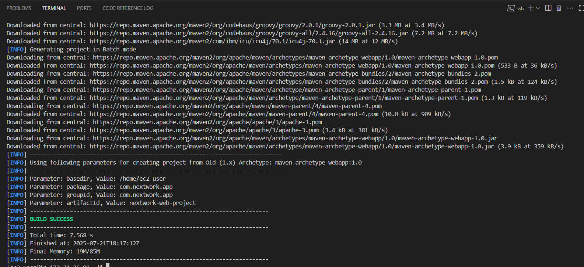

# SoAt - Go Web Service v0.2

A robust and scalable web service built with Go, containerized with Docker, and backed by PostgreSQL and Redis. This project uses a clean, layered architecture to separate concerns and improve maintainability.

---

## ✨ Features

- **Layered Go Backend**: High-performance backend organized by features (Users, Posts, Friendships) across controllers, services, and models.
- **Containerized Environment**: Uses Docker and Docker Compose for consistent development, testing, and production environments.
- **Relational Database**: Integrates with PostgreSQL for reliable data storage, managed by GORM.
- **In-Memory Caching**: Utilizes Redis for fast data access and caching.
- **RESTful API Structure**: Routes are clearly defined and grouped by feature.
- **JWT Authentication**: Secure authentication using JSON Web Tokens with role-based access control.
- **Admin Management**: Dedicated utility for creating admin users with elevated privileges.
- **Robust Error Handling**: Comprehensive error handling throughout the application.

---

## 📋 Prerequisites

Before you begin, ensure you have the following installed on your local machine:

- [Docker](https://www.docker.com/get-started)
- [Docker Compose](https://docs.docker.com/compose/install/) (Typically included with Docker Desktop)

---

## 🚀 Getting Started

Follow these steps to get your development environment up and running.

### 1. Clone the Repository

```bash
git clone <your-repository-url>
cd SoAt
```

### 2. Configure Environment Variables

This project uses a `docker-compose.yaml` file to manage services and their configurations. The environment variables for the Go application are set directly in this file for simplicity in a containerized setup.

All necessary variables for the database and Redis connections are already configured in `docker-compose.yaml` to work within the Docker network.

### 3. Build and Run the Application

Use Docker Compose to build the application's Docker image and start all the services (Go app, PostgreSQL, Redis).

```bash
docker compose up --build
```

- `--build`: This flag forces Docker to rebuild your application's image. This is necessary whenever you make changes to the source code (e.g., `.go` files) or the `Dockerfile`.

Your application will be accessible at `http://localhost:3000`.

### 4. Stopping the Application

To stop all running containers, press `Ctrl + C` in the terminal where the application is running. To remove the containers and the network, run:

```bash
docker compose down
```

To remove the persistent database volume as well (deleting all data), run:
```bash
docker compose down -v
```
---

## 🚀 API Usage Examples

You can interact with the running server using any API client. The following examples use `curl`.

### Authentication

#### Register a New User

**Request:**
```bash
curl -X POST http://localhost:3000/SoAt/auth/register \
-H "Content-Type: application/json" \
-d '{
    "name": "John Doe",
    "email": "john.doe@example.com",
    "password": "securepassword123"
}'
```

#### Login

**Request:**
```bash
curl -X POST http://localhost:3000/SoAt/auth/login \
-H "Content-Type: application/json" \
-d '{
    "email": "john.doe@example.com",
    "password": "securepassword123"
}'
```

**Response:**
```json
{
  "token": "eyJhbGciOiJIUzI1NiIsInR5cCI6IkpXVCJ9...",
  "user": {
    "id": "a1b2c3d4-...",
    "name": "John Doe",
    "email": "john.doe@example.com",
    "role": "user"
  }
}
```

#### Create Admin User

To create an admin user, use the provided utility:

```bash
go run cmd/create_admin/main.go admin@example.com yourpassword
```

Or in Docker:

```bash
docker exec -it soat-soat-1 ./SoAt cmd/create_admin/main.go admin@example.com yourpassword
```

### User Management

#### Create a New User

**Request:**
```bash
curl -X POST http://localhost:3000/SoAt/users \
-H "Authorization: Bearer YOUR_JWT_TOKEN_HERE" \
-H "Content-Type: application/json" \
-d '{
    "name": "John Doe",
    "email": "john.doe@example.com",
    "password": "securepassword123"
}'
```

**Expected Response:**
The server will respond with the newly created user object, including its unique ID and timestamps.

#### Get All Users (Admin Only)

**Request:**
```bash
curl -X GET http://localhost:3000/SoAt/users \
-H "Authorization: Bearer YOUR_JWT_TOKEN_HERE"
```

**Expected Response:**
A JSON array containing all user objects in the database.

#### Get a Single User by ID

**Request:**
```bash
# Replace {user-id} with an actual ID from the GET all users response
curl -X GET http://localhost:3000/SoAt/users/{user-id}
```

#### Delete a User by ID

**Request:**
```bash
# Replace {user-id} with the ID of the user you want to delete
curl -X DELETE http://localhost:3000/SoAt/users/{user-id} \
-H "Authorization: Bearer YOUR_JWT_TOKEN_HERE"
```

**Expected Response:**
A success message indicating the user has been deleted.

### Friendships

#### Create a Friendship

**Request:**
```bash
curl -X POST http://localhost:3000/SoAt/friendships \
-H "Authorization: Bearer YOUR_JWT_TOKEN_HERE" \
-H "Content-Type: application/json" \
-d '{
    "user_id": "user-uuid-here",
    "friend_id": "friend-uuid-here"
}'
```

#### Get User's Friends

**Request:**
```bash
curl -X GET http://localhost:3000/SoAt/friendships/user/{user-id} \
-H "Authorization: Bearer YOUR_JWT_TOKEN_HERE"
```

### Posts

#### Create a Post

**Request:**
```bash
curl -X POST http://localhost:3000/SoAt/users/{user-id}/posts \
-H "Authorization: Bearer YOUR_JWT_TOKEN_HERE" \
-H "Content-Type: application/json" \
-d '{
    "content": "This is my first post!"
}'
```

#### Get User's Posts

**Request:**
```bash
curl -X GET http://localhost:3000/SoAt/users/{user-id}/posts
```

---

## Screenshots


### <b>Used Insomnia for sending REST API Calls<b>


### <b>Building the Docker App<b>

### <b>Docker Repository<b>

### <b>After using Docker Compose on your system<b>

### <b>Docker Desktop Interface<b>

## 📂 Project Structure

The project follows a layered architecture to separate responsibilities:

```
.
├── cmd/                # Main application entry point
│   ├── app/
│   ├── create_admin/   # Admin user creation utility
│   ├── add_role_column/ # Database migration utility
│   └── main.go
├── controllers/        # Handles HTTP request/response logic
│   ├── auth/           # Authentication controllers
│   ├── friendships/
│   ├── posts/
│   └── users/
├── internals/          # Core shared packages
│   ├── auth/           # JWT authentication and middleware
│   ├── cache/          # Redis connection logic
│   ├── constants/      # Application-wide constants
│   ├── database/       # PostgreSQL connection logic
│   ├── dto/            # Data Transfer Objects
│   ├── notifications/
│   ├── validator/      # Input validation
│   └── server/         # HTTP server, handlers, and middleware
├── models/             # GORM database models
│   ├── friendships/
│   ├── posts/
│   └── users/
├── routes/             # API route definitions
│   ├── auth.go
│   ├── friendships.go
│   ├── posts.go
│   └── users.go
├── services/           # Business logic for each feature
│   ├── friendships/
│   ├── posts/
│   └── users/
├── .dockerignore       # Specifies files to ignore in Docker build context
├── .env                # Local environment variables (ignored by Git)
├── .gitignore          # Specifies files to ignore for Git
├── Dockerfile          # Instructions for building the Go application image
├── docker-compose.yaml # Defines and configures all services
├── go.mod              # Go module dependencies
├── go.sum              # Go module checksums
└── README.md           # You are here!
```

### v0.2 Updates

- Added JWT authentication with role-based access control
- Fixed issues with user role management
- Improved error handling and debugging
- Enhanced Docker configuration for better production readiness
- Added admin user creation utility
- Updated API documentation with authentication examples

---

## 🤝 Contributing

Contributions are welcome! Please feel free to submit a pull request or open an issue or email me ( dibyendusahoo03@gmail.com ).